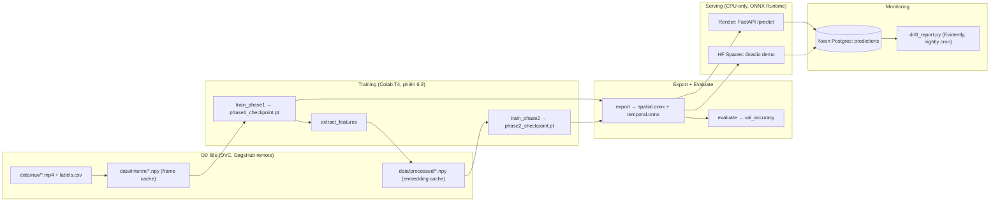

# Architecture — video-action-mlops

Tài liệu này mô tả **cấu trúc thật** của hệ thống (thành phần nào, nối với
nhau ra sao). Phần **"tại sao chọn thiết kế này"** nằm ở
`docs/decisions/` (ADR) — cố ý tách riêng, và phần lý do trong ADR bạn cần
tự viết (xem 2 file ADR đi kèm).

## Tổng quan

Hệ thống nhận diện hành động trong video, kiến trúc 2 giai đoạn:
1. **Spatial backbone** (CNN, per-frame) → embedding.
2. **Temporal aggregator** (attention, per-sequence) → logits phân loại.

## Sơ đồ pipeline

## Thành phần

| Thư mục | Vai trò | Phiên |
|---|---|---|
| `config/` | `AppConfig` hợp nhất (pydantic, fail-fast), 1 nguồn sự thật cho toàn bộ hyperparameter | 1.2, 3.3, 5.2 |
| `data/preprocessing.py` | Hàm thuần: motion scoring, hybrid sampling, augmentation | 2.1–2.2 |
| `data/datasets.py`, `data/labels.py` | PyTorch Dataset đọc cache, chia train/val tất định theo hash | 4.3, 5.2, 7.2 |
| `models/spatial.py` | ResNet18 backbone + curriculum unfreeze | 3.1 |
| `models/temporal.py` | 2 biến thể (Trainable dùng train, Export dùng xuất ONNX) + hàm convert lossless | 3.2 |
| `models/registry.py` | 1 điểm `build_model(cfg)` duy nhất | 3.3 |
| `features/extract_embeddings.py` | Tầng cache thứ 2, khoá theo content-hash | 5.1 |
| `training/` | Training loop 2 giai đoạn + MLflow logging (cặp checkpoint dưới 1 run cha) | 4.3, 5.2, 5.3 |
| `export/` | Xuất ONNX + verify parity bắt buộc trước khi tin | 7.1 |
| `evaluation/evaluate.py` | Đánh giá ĐÚNG artifact sẽ deploy (ONNX), không phải checkpoint train | 7.2 |
| `inference/pipeline.py` | Logic suy luận dùng chung: serving, demo, monitoring reference | 8.1, 10.2, 11.1 |
| `serving/` | FastAPI, deploy Render (CPU-only) | 8.1–8.2, 10.1 |
| `monitoring/` | Log prediction (Neon) + drift report (Evidently) | 9.2, 11.1–11.2 |
| `kernels/` | CUDA kernel tối ưu tuỳ chọn (không bắt buộc) | 6.1–6.2 |
| `demo/gradio_app.py` | Demo public, HF Spaces CPU Basic | 10.2 |
| `colab/bootstrap.ipynb` | GPU ephemeral cho training (không có server GPU 24/7) | 6.3 |
| `docker/serve.Dockerfile` | Image serve, multi-stage, CPU-only | 8.2 |
| `.github/workflows/` | CI (lint/test), build+push image, drift report tự động | 9.1, 11.2 |

## Hạ tầng ngoài (đều free tier)

| Dịch vụ | Vai trò |
|---|---|
| DagsHub | DVC remote (S3-compatible) + MLflow tracking server |
| Neon | Postgres — log prediction cho monitoring |
| Render | Serving API (Web Service, free 512MB RAM) |
| Hugging Face Spaces | Demo public (Gradio, CPU Basic) |
| Google Colab | GPU T4 ephemeral cho training |
| GitHub Actions | CI/CD + cron nightly drift report |
| GHCR | Container registry cho image serve |

## Nợ kỹ thuật đã biết (chưa vá, ghi lại có chủ đích)

- `SpatialBackbone` chưa hỗ trợ `use_motion_channel=True` (4 channel) — fail-fast rõ ràng ở nhiều nơi (phiên 5.1, 8.1, 10.2, 11.1) thay vì crash khó hiểu.
- Chưa có bảng ánh xạ `predicted_class` (int) → tên hành động thật.
- `MODEL_VERSION` ở serving là placeholder qua env var, chưa nối với MLflow Model Registry version thật.
- Checkpoint không lưu optimizer state — không resume training giữa chừng được.
